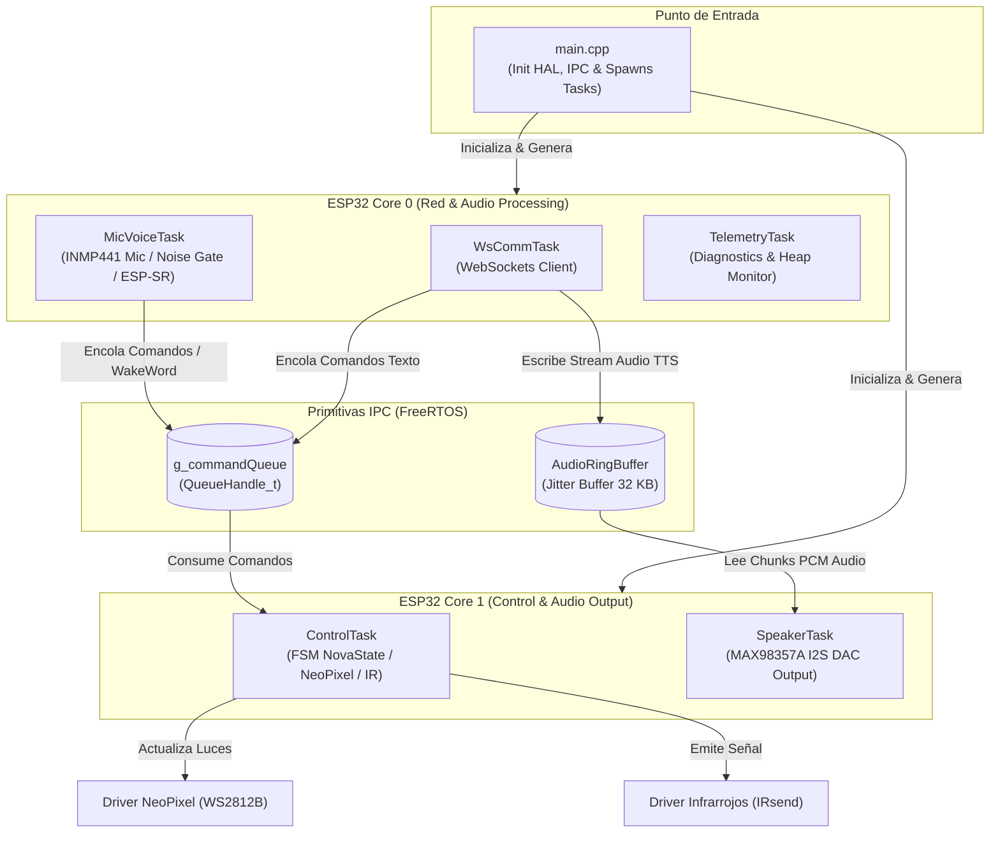

# 🤖 Robot Assistant - Nova Core Firmware

Firmware modular de alto rendimiento para **ESP32** diseñado con arquitectura mixta **Baremetal HAL + Multitarea FreeRTOS en tiempo real**, **cero delays bloqueantes**, soporte para streaming de audio bidireccional por **WebSockets** y procesamiento de voz **Offline Edge AI (ESP-SR)**.

---

## 🏛️ Arquitectura del Sistema

La arquitectura está construida en capas desacopladas para maximizar la escalabilidad, la mantenibilidad y la respuesta en tiempo real.



### Principios Clave:
1. **Zero Delays Bloqueantes**: Toda la temporización y sincronización utiliza `vTaskDelayUntil`, colas IPC (`QueueHandle_t`) y mutexes de FreeRTOS. Ninguna tarea bloquea el bucle de la CPU.
2. **Dual Core ESP32**:
   - **Core 0 (Red & Audio Processing)**: `WsCommTask`, `MicVoiceTask`, `TelemetryTask`.
   - **Core 1 (Tiempo Real & Control)**: `ControlTask` (FSM + NeoPixel), `SpeakerTask` (I2S DAC playback).
3. **Jitter Ring Buffer (32 KB)**: Buffer circular thread-safe que absorbe variaciones de latencia en la red Wi-Fi para reproducir audio síntesis de voz (TTS) de forma fluida y continua sin chasquidos ni cortos.

---

## 📌 Mapeo de Pines de Hardware (Pinout)

| Componente | Función / Señal | Pin ESP32 (GPIO) | Descripción |
| :--- | :--- | :--- | :--- |
| **Micrófono INMP441** | `MIC_WS` | **GPIO 5** | Word Select / Left-Right Clock |
| | `MIC_SCK` | **GPIO 18** | Bit Clock |
| | `MIC_SD` | **GPIO 32** | Serial Data Input |
| **Parlante MAX98357A** | `SPK_LRC` | **GPIO 19** | Left-Right Clock |
| | `SPK_BCLK` | **GPIO 21** | Bit Clock |
| | `SPK_DIN` | **GPIO 22** | Data Input to DAC |
| **Anillo LED WS2812B** | `LED_PIN` | **GPIO 4** | Datos NeoPixel (12 LEDs) |
| **Emisor Infrarrojo** | `IR_PIN` | **GPIO 25** | Transmisor IR (Comandos NEC) |
| **LED de Estado** | `STATUS_LED` | **GPIO 2** | LED integrado en placa |
| **Botón de Usuario** | `USER_BUTTON` | **GPIO 0** | Botón BOOT / Entrada física |

---

## 📁 Estructura del Proyecto

```
robot_assientent/
├── platformio.ini              # Configuración del entorno de compilación y librerías
├── .gitignore                  # Exclusión de binarios y temporales
├── include/
│   ├── config/
│   │   └── system_config.h     # Parámetros del sistema, pines, tamaños de stack y prioridades
│   ├── core/
│   │   ├── ipc_handles.h       # Declaración global de Colas y Mutexes de FreeRTOS
│   │   └── system_types.h      # Enums (NovaState, CommandType, IrCommand) y Estructuras IPC
│   ├── drivers/
│   │   ├── audio_i2s_driver.h  # Driver HAL I2S para Micrófono INMP441 e I2S Speaker
│   │   ├── gpio_driver.h       # Driver HAL no bloqueante para GPIO y patrones LED
│   │   ├── ir_driver.h         # Driver para emisión de códigos IR Infrarrojos
│   │   ├── neopixel_driver.h   # Driver de animaciones para el anillo LED WS2812B
│   │   ├── ring_buffer.h       # Buffer circular thread-safe para audio en streaming
│   │   └── wifi_driver.h       # Abstracción de conexión inalámbrica Wi-Fi
│   └── tasks/
│       ├── control_task.h      # Tarea FreeRTOS para Máquina de Estados FSM y LEDs
│       ├── mic_voice_task.h    # Tarea de captura de voz, Noise Gate y motor Offline ESP-SR
│       ├── speaker_task.h      # Tarea de reproducción de audio PCM por I2S
│       ├── telemetry_task.h    # Tarea de diagnóstico de memoria Heap y estado de red
│       └── ws_comm_task.h      # Tarea cliente WebSocket para conexión con Python Brain
└── src/
    ├── core/
    │   └── ipc_handles.cpp
    ├── drivers/
    │   ├── audio_i2s_driver.cpp
    │   ├── gpio_driver.cpp
    │   ├── ir_driver.cpp
    │   ├── neopixel_driver.cpp
    │   ├── ring_buffer.cpp
    │   └── wifi_driver.cpp
    ├── tasks/
    │   ├── control_task.cpp
    │   ├── mic_voice_task.cpp
    │   ├── speaker_task.cpp
    │   ├── telemetry_task.cpp
    │   └── ws_comm_task.cpp
    └── main.cpp               # Punto de entrada principal
```

---

## 🚦 Estados del Robot (`NovaState`)

El estado del asistente se refleja visualmente en el **Anillo LED NeoPixel**:

| Estado | Color Anillo LED | Descripción |
| :--- | :--- | :--- |
| **`BOOTING`** | 🔵 **Azul Fijo** | Inicialización del hardware y conexión a red |
| **`LISTENING`** | 🟢 **Verde Fijo** | En espera de audio o comando de voz |
| **`THINKING`** | 🟡 **Amarillo Fijo** | Procesando audio o esperando respuesta del servidor |
| **`SPEAKING`** | 🟣 **Morado Pulsante** | Reproduciendo síntesis de voz (TTS) en el parlante |
| **`SLEEPING`** | ⚪ **Apagado** | Modo de bajo consumo en reposo |
| **`ERROR`** | 🔴 **Flash Rojo** | Fallo del sistema o desconexión |

---

## 🌐 Modos de Operación

### 1. Modo Online (WebSocket Streaming con Python Brain)
- El micrófono encola las muestras de audio PCM cuando superan el umbral de ruido (*Smart Noise Gate*).
- Se envía el audio binario en tiempo real al servidor en `192.168.29.232:8000/esp32`.
- El servidor responde con comandos de texto (`CLEAR_AUDIO`, `SLEEP`, `RGB_ON`, `RGB_RED`, etc.) o paquetes de audio binario que se reproducen fluidamente mediante el **Audio Ring Buffer**.

### 2. Modo Offline (Standalone / Sin Internet)
- Cuando el ESP32 no detecta conexión a Wi-Fi o servidor, activa de forma automática el motor de reconocimiento local **ESP-SR / Offline KWS**.
- Permite detectar palabras de activación y ejecutar comandos locales sin depender de internet.

---

## 🚀 Guía de Compilación y Despliegue

### Requisitos Previos
- **Visual Studio Code** con la extensión **PlatformIO IDE**.

### Pasos para Compilar e Instalar:

1. **Clonar / Abrir el proyecto en PlatformIO**:
   ```bash
   cd robot_assientent
   ```

2. **Compilar el código**:
   ```bash
   pio run
   ```

3. **Cargar el firmware al ESP32**:
   Conecta el ESP32 por USB y ejecuta:
   ```bash
   pio run -t upload
   ```

4. **Abrir el Monitor Serial para diagnósticos**:
   ```bash
   pio device monitor
   ```

---

## 📄 Licencia y Créditos
Desarrollado para el proyecto **Robot Assistant / Nova Core** (USC).
